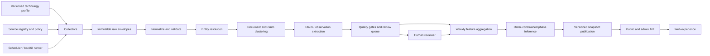

# ARGUS product blueprint

**Document status:** Aspirational research and product blueprint; not a statement of current behavior
**Implemented contract:** [Methodology](METHODOLOGY.md), [HTTP API](API.md), [admin status](ADMIN_CONSOLE_PLAN.md)
**Version:** 0.2
**Date:** 2026-07-27
**Current showcase technologies:** AI agent harnesses; Model Context Protocol (MCP); AI browser agents
**Snapshot cadence:** Weekly
**Product framing:** Technology Hype & Maturity Tracker

---

> Important: sections below describe the intended long-term system and include
> unimplemented capabilities such as semantic claim extraction, calibrated source
> independence, PostgreSQL, durable stage jobs, and human publication workflows.
> Consult the implemented-contract links above for what the repository does today.

## 1. Executive summary

ARGUS will be a web application that estimates where a technology appears to be in a five-stage hype-and-maturity lifecycle. The estimate will not be derived from internet sentiment alone. It will infer a latent phase from six evidence dimensions:

1. Attention
2. Expectations
3. Disappointment
4. Adoption
5. Maturity
6. Momentum

The MVP began with one deliberately defined technology category, **AI agent harnesses**, and the showcase now also tracks **Model Context Protocol (MCP)** to prove the configuration-driven multi-technology path. It ingests historical and current evidence from curated news, technical-community, repository, registry, and production-adoption sources. It normalizes and deduplicates that evidence, extracts checkable claims, aggregates weekly features, and runs an explainable, order-constrained inference model.

The public website will show:

- The current estimated phase
- Confidence as a range or band, not false precision
- Direction of movement
- The evidence supporting the estimate
- Contradictory evidence
- Historical weekly estimates
- Data freshness and methodology

The architecture will be a modular monolith for the MVP. Domain boundaries and extension interfaces will make it possible to add technologies, domains, languages, source types, evidence dimensions, inference models, and comparative views later without prematurely operating a distributed system.

The core product promise is:

> A defensible, inspectable estimate of the gap between what the internet promises and what real-world adoption demonstrates.

---

## 2. Product thesis and measurement contract

### 2.1 The problem

Technology coverage mixes announcements, marketing, genuine technical progress, speculation, developer experience, production adoption, and disappointment. Raw article counts or positive/negative sentiment cannot distinguish between these conditions.

For example, positive language could mean that a technology has just been introduced, is approaching inflated expectations, or is mature and delivering value. Falling media volume could indicate disillusionment, or it could mean that the technology has become stable infrastructure and no longer attracts headlines.

ARGUS will therefore treat lifecycle phase as a **hidden state inferred from heterogeneous observations**, rather than as a label directly emitted by an LLM or a sentiment classifier.

### 2.2 What ARGUS will claim

ARGUS will claim only that, based on its declared sources, definitions, evidence weighting, model version, and snapshot date, the observed evidence is most consistent with one phase and movement direction.

It will not claim that:

- The estimate is an official Gartner classification
- The five stages are objectively measurable natural laws
- Media tone alone measures technology maturity
- A precise coordinate on a curve is scientifically exact
- All industries, regions, or user groups experience the same cycle
- The model predicts investment returns or recommends investments
- Absence of collected evidence proves absence of adoption

### 2.3 Why the evidence panel is the product

The visual curve earns attention, but the evidence and methodology create trust. Every published estimate must answer:

- What phase is most likely?
- How confident is ARGUS?
- Is the technology moving, stable, or uncertain?
- Which observations drove the estimate?
- Which observations contradict it?
- How fresh and complete is the dataset?
- Which model and policy versions produced it?
- Was it reviewed or corrected by a human?

No phase estimate should be published if it cannot provide traceable evidence and a reproducible explanation.

---

## 3. MVP goals, non-goals, and success criteria

### 3.1 MVP goals

1. Define “AI agent harnesses” and “Model Context Protocol (MCP)” tightly enough to collect relevant evidence with acceptable precision.
2. Backfill weekly evidence from 2023-01-01 through the current week without future-data leakage.
3. Ingest new evidence continuously and publish one stable snapshot each week.
4. Combine media attention and claims with empirical adoption and maturity signals.
5. Cluster syndicated articles, press-release rewrites, and repeated claims so repetition is not mistaken for independent confirmation.
6. Produce an explainable phase estimate, confidence assessment, direction, supporting evidence, and contradictory evidence.
7. Provide an internal review workflow before or shortly after publication.
8. Deliver a simple, responsive public website with a historical time control.
9. Version all technology definitions, source policy, features, models, and generated snapshots.
10. Establish extension points for additional technology categories and evidence dimensions.

### 3.2 Explicit non-goals for the MVP

- Tracking multiple technology categories at launch
- Real-time phase changes or minute-by-minute news monitoring
- Exhaustive crawling of the public web
- Treating X/Twitter or other social feeds as foundational evidence
- Training a black-box phase classifier from scarce, subjective labels
- Building a generic data-integration platform before the first tracker works
- Automatic investment, procurement, or strategic recommendations
- Multi-language analysis at launch
- Personalized cycles by industry, geography, or company size
- Public user accounts, comments, voting, or community submissions
- A mobile application
- Reproducing a trademarked visual design or implying Gartner affiliation

### 3.3 Product success criteria

The MVP succeeds when a skeptical reader can inspect a weekly estimate and understand why it exists, while an operator can reproduce it from versioned inputs.

Recommended launch gates:

| Area | Gate |
|---|---|
| Historical coverage | At least 90% of weekly windows since 2023-01-01 meet minimum source coverage, or are explicitly marked incomplete |
| Entity matching | At least 95% precision and 85% recall on a reviewed test corpus |
| Duplicate clustering | At least 95% pair precision and 85% pair recall on a reviewed duplicate set |
| Evidence extraction | At least 85% precision for claims shown publicly; low-confidence claims remain hidden or queued |
| Traceability | 100% of public evidence links to provenance and extraction/model versions |
| Explainability | 100% of snapshots include supporting and contradictory evidence, or an explicit “none found” notice |
| Reproducibility | Re-running a frozen snapshot produces the same aggregate inputs and phase distribution |
| Temporal integrity | Backtests use only evidence available by the simulated cutoff |
| Reviewer agreement | Two reviewers agree on the exact or adjacent phase for at least 80% of evaluation weeks |
| Accessibility | Public flow targets WCAG 2.2 AA, including keyboard use and a non-visual chart summary |
| Reliability | Weekly publication completes automatically and exposes failure/freshness status |

These are starting gates, not claims of universal scientific validity. Thresholds should be revised with documented evidence.

---

## 4. MVP technology definition: AI agent harnesses

### 4.1 Working definition

An AI agent harness is runtime and control-layer software surrounding a foundation model to run multi-step agent loops, select and execute tools, manage context or state, enforce permissions, recover from failures, and expose execution traces or evaluations.

This is a **technology category**, not a single vendor, product, protocol, or repository.

### 4.2 Inclusion rules

Evidence is in scope when all of the following are true:

- It concerns software agents based on foundation models.
- It describes a reusable harness, runtime, framework, SDK, or control layer.
- It involves multi-step execution or decisions, not only one prompt and one response.
- It provides a signal for at least one tracked dimension.
- Product-level evidence is relevant to the broader category, not merely a product advertisement.

Qualifying harness responsibilities may include:

- Agent loops and stopping conditions
- Tool registration, selection, invocation, and result handling
- Context-window and memory/state management
- Task planning and delegation
- Permissions, sandboxing, and approval gates
- Retry, checkpoint, rollback, and failure recovery
- Tracing, observability, evaluation, or cost controls
- Multi-agent coordination
- Model/provider routing within an agent execution

### 4.3 Exclusion rules

The following are out of scope unless the evidence specifically concerns a harness capability:

- Foundation models and model releases
- Generic chat applications
- Single-call prompt libraries
- Retrieval systems without an agent loop
- Conventional workflow engines with no foundation-model control
- Physical/robotics agents not connected to the defined software category
- General AI funding or market-size stories
- Incidental occurrences of “agent,” “harness,” or “orchestration”

### 4.4 Entity-resolution strategy

The category is semantically broad and the phrase “agent harness” is not consistently used. Matching must combine:

- Versioned canonical phrases
- Contextual phrases such as “agent runtime” or “agent framework”
- Required contextual concepts such as LLMs, tool use, or agentic AI
- Explicit negative terms and unrelated meanings
- Product/repository aliases maintained in a curated registry
- Embedding or classifier assistance only after deterministic filtering
- A review queue for ambiguous matches

The starter definition lives in `config/technologies/ai-agent-harness.yaml`. Changes to that file can change historical measurements, so every definition change must create a new profile version and trigger an explicit reprocessing decision.

### 4.5 Avoiding category leakage

Product announcements can dominate category evidence. ARGUS must prevent a high-volume vendor from being treated as the whole market by recording:

- The actor/vendor associated with every claim
- Whether the claim is first-party or independent
- The number of distinct organizations supporting a signal
- Concentration of evidence by source, vendor, and claim cluster
- Vendor diversity as a maturity feature

A weekly summary should expose when one vendor or announcement accounts for a large fraction of the score.

---

## 5. Users and core journeys

### 5.1 Primary users

- **Technology leaders:** want a fast, defensible view of hype versus demonstrated adoption.
- **Builders and researchers:** want to inspect evidence, movement, and methodology.
- **ARGUS analyst/reviewer:** needs to correct entity matches, clusters, claims, and phase decisions.
- **ARGUS operator:** needs to monitor collection, costs, failures, freshness, and weekly publication.

### 5.2 Public user journey

1. Open the ARGUS overview.
2. See the current phase, confidence, movement, snapshot date, and data-freshness notice.
3. Read a one-sentence explanation of the estimate.
4. Explore dimension scores and the expectations-versus-adoption gap.
5. Open supporting and contradictory evidence.
6. Move the historical time control to compare earlier weeks.
7. Read the methodology and source-coverage disclosure.
8. Copy a stable link to a particular snapshot.

### 5.3 Reviewer journey

1. Open prioritized review items.
2. Inspect source provenance, normalized text/excerpt, category match, duplicate cluster, and extracted claims.
3. Accept, correct, exclude, merge, or split the item.
4. Record a reason code and optional note.
5. Preview the effect on weekly features and phase probabilities.
6. Approve a weekly snapshot or flag it as incomplete.
7. Preserve the automated output and human override in the audit log.

---

## 6. Evidence and measurement model

### 6.1 Evidence dimensions

| Dimension | Meaning | Example measures |
|---|---|---|
| Attention | How much independent interest the category receives | Normalized article clusters, search interest, technical discussions |
| Expectations | How ambitious public claims and forecasts are | Transformational claims, launches, funding, forecasts, promised impact |
| Disappointment | Evidence that expectations are failing or contracting | Failed projects, criticism, security/reliability incidents, abandonment, consolidation |
| Adoption | Evidence that people and organizations actually use the category | Production case studies, integrations, active dependencies, jobs, recurring usage |
| Maturity | Evidence the technology is stable, governable, diverse, and repeatable | Release stability, docs/evals, vendor diversity, standards, operational practices |
| Momentum | The direction, rate, and acceleration of other signals | Week-over-week and smoothed change, inflection points, persistence |

Each dimension needs both a level and a trajectory. Raw values are not directly comparable across dimensions.

### 6.2 Evidence unit: a checkable claim

Document-level sentiment is too coarse. A single article may contain a bullish headline, a verified adoption fact, and serious limitations. The primary analytical unit will therefore be an **evidence claim**.

Each claim should contain:

- Claim type
- Normalized claim statement
- Technology/category relevance
- Dimension and polarity
- Actor and affected product/project
- Measurable quantity and unit, if present
- Event/effective date, if present
- Source document and exact permitted excerpt/span
- First-party versus independent status
- Specificity and extraction confidence
- Corroborating or contradicting claim-cluster ID
- Human-review status

Example claim types:

- `release`
- `specification_change`
- `funding`
- `forecast`
- `transformational_claim`
- `integration`
- `production_adoption`
- `measured_outcome`
- `developer_activity`
- `limitation`
- `incident`
- `failed_deployment`
- `deprecation`
- `abandonment`
- `consolidation`

### 6.3 Contextual source weighting

Source reputation is a prior, not the final weight. A first-party vendor is authoritative about its own release but not independent evidence of broad market adoption. A small engineering team may provide stronger maturity evidence when it publishes a specific, measured production report.

For each evidence claim, compute:

```text
evidence_weight =
    source_reliability_prior
  × technology_relevance
  × claim_type_fit
  × independence
  × specificity
  × freshness
  × corroboration_quality
  × extraction_quality
```

All factors must be bounded and logged. No hidden, source-specific manual bonus should exist outside versioned policy.

Interpretation of factors:

- **Source reliability prior:** historical/editorial reliability of the source class.
- **Technology relevance:** confidence that the claim concerns the tracked category.
- **Claim-type fit:** whether this source is positioned to know this kind of fact.
- **Independence:** distance from the actor benefiting from the claim.
- **Specificity:** presence of concrete actors, dates, quantities, methods, or outcomes.
- **Freshness:** time decay appropriate to the claim type.
- **Corroboration quality:** confirmation by genuinely independent sources.
- **Extraction quality:** deterministic/LLM extraction certainty and reviewer status.

The starter source policy lives in `config/sources/default.yaml`.

### 6.4 Duplicate and claim clustering

One press release copied by 100 outlets is one underlying event, not 100 independent observations.

Deduplication will run at two levels:

1. **Document clustering**
   - Canonical URL
   - Exact and near-exact content hashes
   - Title/lead similarity
   - Publication-time proximity
   - Syndication markers and cited origin

2. **Claim/event clustering**
   - Same actor, action, object, date, and quantity
   - Semantic similarity
   - Shared first-party origin
   - Explicit citations between sources

Clusters use diminishing returns. The first independent item receives its contextual weight; repeated rewrites add little. Multiple truly independent reports may increase confidence, but source diversity must be measured explicitly.

### 6.5 Normalization and baselines

Counts must be normalized because the global volume of indexed content changes over time, source coverage differs, and the category grows.

Candidate normalizations:

- Share of all technology coverage collected from the same source/window
- Distinct claim clusters rather than raw documents
- Distinct organizations rather than raw mentions
- Per-source z-scores against trailing baselines
- Robust percentiles using median and median absolute deviation
- Log transforms for heavy-tailed counts
- Concentration penalties when a single actor dominates
- Coverage adjustment when expected collectors were unavailable

Initial feature windows:

- Current weekly value
- 4-week exponentially weighted mean
- 13-week trend
- 26-week baseline
- 52-week seasonal comparison when sufficient history exists

The earliest backfilled weeks will have reduced confidence until trailing windows become available.

### 6.6 Hype gap

ARGUS should expose a derived **hype gap** rather than only sentiment:

```text
hype_gap = normalized_expectations - normalized_verified_adoption
```

Interpretation:

- Large positive gap: claims are outrunning demonstrated use.
- Closing positive gap: adoption is catching up, or expectations are correcting.
- Near-zero gap with high maturity: evidence is consistent with productivity.
- Negative gap: adoption may be under-covered, or the media may treat the technology as infrastructure.

This is a diagnostic, not the phase classifier by itself.

### 6.7 Phase definitions

1. **Innovation trigger**
   Technical breakthroughs or category formation appear. Attention rises from a low base; adoption and operational maturity remain limited.

2. **Peak of inflated expectations**
   Attention and ambitious claims grow rapidly, typically faster than verified adoption. Launches, forecasts, and funding are prominent. Evidence can still include real progress.

3. **Trough of disillusionment**
   Attention or sentiment contracts, disappointment evidence rises, projects fail or consolidate, and earlier expectations are revised. Some genuine adoption may continue.

4. **Slope of enlightenment**
   Attention stabilizes while independent production use, measured outcomes, operational practices, integrations, and maturity increase.

5. **Plateau of productivity**
   Adoption and maturity are sustained across diverse independent organizations. Releases and operations are predictable; excitement is less important than repeatable utility.

### 6.8 Inference approach

The first production model should be an explainable, order-constrained probabilistic state model, not an LLM assigning a phase from articles.

Recommended approach:

1. Convert weekly evidence into normalized dimension features.
2. Produce an emission likelihood for each phase using versioned, interpretable rules or a small Bayesian model.
3. Combine emission likelihoods with phase-transition priors.
4. Allow the model to remain in the same phase or move to an adjacent phase by default.
5. Penalize multi-phase jumps and backward movement.
6. Support an explicit “cycle reset” event when a material technical discontinuity is reviewed and approved.
7. Produce a probability distribution over all five phases.
8. Separate automated probability from any human override.

An HMM can implement the first version. A Bayesian state-space model may later better represent uncertainty and continuous latent variables. The interface should permit either without changing collectors or the public API.

### 6.9 Confidence

Confidence must not simply equal the probability of the winning phase. It should reflect:

- Source coverage and freshness
- Evidence volume after deduplication
- Independence and actor diversity
- Agreement or conflict among dimensions
- Separation between the top phase probabilities
- Stability under feature/model perturbation
- Historical completeness
- Reviewer status

The UI should use bands such as low, moderate, and high, with the underlying probability distribution available in the API. Avoid showing “64.27% accurate.”

### 6.10 Movement and stability

Movement is separate from phase:

- `advancing`: sustained probability movement toward the next phase
- `stable`: no material movement beyond noise
- `regressing`: reviewed evidence supports backward movement
- `resetting`: a reviewed discontinuity may begin a new cycle
- `uncertain`: insufficient or conflicting evidence

A single noisy week must not flip direction. The rule should require persistence or a high-impact reviewed event.

### 6.11 Explanation payload

Every weekly estimate will store a generated explanation object, not only prose:

```json
{
  "phase": "peak_of_inflated_expectations",
  "confidence_band": "moderate",
  "movement": "advancing",
  "summary": "Expectations and coverage are rising faster than verified adoption.",
  "drivers": [
    {"feature": "independent_attention_growth", "direction": "up", "importance": 0.82},
    {"feature": "transformational_claim_rate", "direction": "up", "importance": 0.77}
  ],
  "supporting_claim_ids": ["..."],
  "contradicting_claim_ids": ["..."],
  "coverage_warnings": [],
  "model_version": "...",
  "feature_set_version": "..."
}
```

Public prose should be generated from this payload so explanations remain consistent and testable.

---

## 7. Data-source strategy

### 7.1 Source tiers for the MVP

The source registry should include a deliberately small, reviewed set.

**Tier A: first-party and machine-verifiable**

- Official project/vendor release and engineering feeds
- Source repositories, releases, issues, and contributor activity
- Package/container registries where relevant
- Specification, governance, or standards pages
- Documented incident and deprecation notices

**Tier B: independent reporting and production evidence**

- Established technology news and analysis outlets
- Independent engineering blogs with production details
- Public case studies with identifiable organizations and measurable outcomes
- Academic papers and credible benchmark reports

**Tier C: structured community attention**

- Hacker News discussions
- Selected developer forums
- Stack Overflow or similar question trends when category matching is reliable

**Deferred or optional**

- Broad social feeds, especially X/Twitter
- Generic web crawling
- Paywalled full-text collection without an appropriate license
- Unmoderated user submissions
- Multilingual sources

### 7.2 News collection

News can be collected from licensed/search APIs, RSS/Atom feeds, and source-specific permitted endpoints. The exact provider should be selected after evaluating:

- Historical depth and backfill pagination
- Coverage transparency
- Terms allowing metadata, snippets, and derived analysis
- Stable identifiers and canonical URLs
- Publication timestamps and corrections
- Rate limits and cost
- Ability to retrieve normalized total-volume baselines

ARGUS should not couple its canonical model to one news vendor. Every collector maps provider results into the same raw envelope.

### 7.3 Adoption and maturity collection

Media sources are necessary but insufficient. Candidate category signals include:

- Repository releases, contributor diversity, issue resolution, and active maintenance
- Package downloads or dependents where a category-specific package set is defensible
- Public integrations and compatibility announcements
- Independent production case studies
- Job descriptions requiring agent-harness skills
- Security/reliability incidents and mitigations
- Evaluation, tracing, permission, and governance practices
- Standards or interoperability activity
- Abandonment, archival, deprecation, and consolidation

Repository stars are attention proxies, not direct adoption. Downloads may include CI traffic, mirrors, or transitive use. Each proxy must declare its limitations.

### 7.4 Historical backfill strategy

Backfill is a first-class product requirement, not a one-time script.

Recommended initial range: 2023-01-01 to the current week. The tracking start is versioned in the technology profile.

Backfill procedure:

1. Freeze technology-profile and source-registry versions.
2. Divide each source into resumable time partitions.
3. Record source coverage and query parameters for every partition.
4. Save immutable raw response envelopes where terms permit.
5. Normalize documents and observations with collector versions.
6. Run entity matching, duplicate clustering, and claim extraction.
7. Queue low-confidence/high-impact items for review.
8. Aggregate weekly features using only evidence available by each cutoff.
9. Run phase inference forward chronologically.
10. Generate a backfill-quality report before publication.

Backfill jobs must be idempotent, resumable, rate-limited, and safe to rerun.

### 7.5 Temporal integrity and future-data leakage

Every record must preserve several distinct times:

- `published_at`: claimed source publication time
- `event_at`: when the underlying event occurred, if known
- `first_seen_at`: when ARGUS first observed the item
- `retrieved_at`: when this copy was fetched
- `available_at`: earliest defensible time it could enter a historical snapshot
- `corrected_at` or `deleted_at`: source lifecycle changes

Historical inference for cutoff `T` may use only evidence where `available_at <= T`. A later correction may produce a newly versioned historical snapshot, but ARGUS must retain the original as-published result and disclose the revision.

### 7.6 Content and retention policy

Default to storing:

- Source ID, URL, author/publisher, timestamps, title, permitted excerpt
- Content and response hashes
- Extracted claims and evidence spans where permitted
- Fetch status, headers needed for caching, and provenance
- License/terms classification and retention decision

Do not store or republish full copyrighted article text unless the source terms or a license permit it. Raw storage should support source-specific retention and deletion.

---

## 8. End-to-end pipeline



### 8.1 Pipeline stages

1. **Discover**: source adapters enumerate candidate items for a time window.
2. **Fetch**: permitted content/metadata is retrieved with caching and rate limits.
3. **Persist raw**: original provider response and provenance are stored immutably.
4. **Normalize**: provider shapes become canonical documents/observations.
5. **Resolve entity**: in-scope, out-of-scope, or ambiguous classification.
6. **Cluster**: duplicates, syndication, shared origins, and repeated events are linked.
7. **Extract evidence**: deterministic parsers and schema-constrained LLM extraction produce claims.
8. **Validate**: types, spans, dates, URLs, units, and confidence are checked.
9. **Review**: high-impact or uncertain records are prioritized for human action.
10. **Aggregate**: claims and machine observations become weekly features.
11. **Infer**: phase distribution, confidence, movement, and drivers are computed.
12. **Publish**: immutable snapshot is approved and exposed through the API.

### 8.2 Idempotency

Each stage needs a deterministic idempotency key based on relevant inputs and versions. Examples:

- Raw fetch: source + external ID/canonical URL + retrieval version
- Normalization: raw object hash + normalizer version
- Claim extraction: normalized content hash + extraction schema/model/prompt version
- Feature aggregation: technology-profile version + feature-set version + week + eligible evidence revision
- Inference: feature snapshot hash + model version + previous-state version

Retries must not create duplicate evidence or silently overwrite reviewed records.

### 8.3 Failure isolation

A single broken source or malformed article must not fail a weekly run. Jobs should be partitioned, retryable, and dead-lettered after bounded attempts. Publication can proceed only if minimum coverage gates pass or a reviewer explicitly publishes an incomplete snapshot with a visible warning.

---

## 9. System architecture

### 9.1 Architectural style

Use a **modular monolith** with separately runnable processes:

- Public/admin web frontend
- HTTP API
- Background worker
- Scheduler/backfill runner

API and worker share the same Python domain packages and database, but communicate through durable jobs and persisted state. Module interfaces should be explicit enough to extract a service later if scale or ownership justifies it.

### 9.2 Recommended technology choices

Versions should be pinned when implementation begins.

| Concern | MVP choice | Reason |
|---|---|---|
| Frontend | TypeScript + React framework with server rendering | Accessible public pages, stable snapshot URLs, good chart/component ecosystem |
| API and pipeline | Python + FastAPI | Strong data/ML ecosystem, typed API models, async collection support |
| Domain validation | Typed Python models | Shared validation across collectors, pipeline, and API |
| Relational store | PostgreSQL | Transactions, JSON support, indexing, auditability, mature operations |
| Raw/object storage | S3-compatible object store; local equivalent in development | Cheap immutable raw payloads and reprocessing |
| Job scheduling | Database-backed jobs plus cron/scheduler for MVP | Avoid an extra distributed queue while preserving durable work |
| Migrations | Versioned PostgreSQL migration tool | Reproducible schema changes |
| Chart | Accessible SVG/Canvas chart library behind an ARGUS component | Custom visual without coupling business data to a library |
| Extraction | Provider-neutral, schema-constrained LLM adapter plus deterministic parsers | Avoid lock-in and keep output testable |
| Local environment | Container composition | Repeatable database/object-store/application startup |

Redis, Kafka, a workflow orchestrator, a search cluster, and a vector database are not default MVP dependencies. Add them only after a measured need.

### 9.3 Runtime components

**Web**

- Public overview and snapshot pages
- Methodology and source disclosure
- Internal review/admin routes protected by authentication
- Server-side loading for stable, shareable snapshots

**API**

- Read APIs for technology, snapshots, dimensions, evidence, and methodology
- Admin APIs for review, runs, and publication
- Authentication/authorization for non-public operations
- Cache and ETag support for immutable snapshots

**Worker**

- Collection and fetch jobs
- Normalization and entity resolution
- Deduplication and clustering
- Evidence extraction
- Feature aggregation and inference
- Evaluation and export jobs

**Scheduler/backfill runner**

- Source polling schedules
- Weekly snapshot orchestration
- Historical partition creation
- Retry and coverage checks

### 9.4 Domain boundaries

The initialized backend directories map to these responsibilities:

| Module | Responsibility | Must not own |
|---|---|---|
| `domain` | Core entities, claim types, phase vocabulary, policy/value objects | HTTP, SQL, provider SDKs |
| `ingestion` | Collector contracts, raw envelopes, fetch orchestration | Phase logic |
| `normalization` | Canonical documents, timestamps, URLs, source mapping | Source weighting |
| `enrichment` | Entity resolution, deduplication, claim extraction | Publication |
| `features` | Feature registry, windows, normalization, aggregation | UI formatting |
| `inference` | Phase models, transition policy, confidence, explanations | Data fetching |
| `review` | Review queues, decisions, overrides, audit operations | Automated extraction internals |
| `storage` | Repositories, transactions, object-store adapters, job persistence | Domain policy decisions |
| `api` | Public/admin transport and serialization | Core inference algorithms |
| `observability` | Metrics, structured logging, tracing, run summaries | Business decisions |

### 9.5 Ports and extension interfaces

Define narrow interfaces early:

```text
Collector.discover(window, technology_profile) -> RawCandidate[]
Fetcher.fetch(candidate) -> RawEnvelope
Normalizer.normalize(raw_envelope) -> CanonicalDocument | Observation
EntityResolver.resolve(document, technology_profile) -> EntityDecision
Clusterer.assign(document_or_claim) -> ClusterDecision
EvidenceExtractor.extract(document) -> EvidenceClaim[]
FeatureProvider.compute(context, week) -> FeatureValues
PhaseModel.infer(feature_snapshot, previous_state) -> PhaseEstimate
ExplanationBuilder.build(estimate, evidence) -> Explanation
```

Provider-specific payloads must stop at the collector/normalizer boundary. Public APIs must expose domain concepts, not provider response shapes.

### 9.6 Storage choices

Use PostgreSQL for canonical metadata, evidence, reviews, jobs, features, snapshots, and audit history. Use object storage for permitted raw provider responses and large artifacts.

An embedding column or vector extension can be added for semantic clustering, but canonical cluster membership must remain explicit and reviewable. The system must still work with deterministic similarity when embeddings are unavailable.

### 9.7 Deployment topology

**Local**

- Web process
- API process
- Worker process
- Scheduler process
- PostgreSQL
- Optional local S3-compatible object store

**Initial production**

- One web deployment
- One API deployment
- One or more worker processes from the same backend image
- Managed PostgreSQL
- Managed object storage
- Platform scheduler/cron
- Central logs, error tracking, and metrics

Scale collectors and extraction workers independently only when required. Keep inference single-writer per technology/week to avoid conflicting publication.

---

## 10. Canonical data model

The names below are conceptual; migrations should use consistent naming and constraints.

### 10.1 Configuration and identity

**`technologies`**

- `id`
- `slug`
- `display_name`
- `kind`
- `status`
- `created_at`, `updated_at`

**`technology_profile_versions`**

- `id`, `technology_id`, `version`
- `definition`
- `inclusion_rules`, `exclusion_rules`
- `query_facets`, `aliases`
- `tracking_start`, `snapshot_cadence`
- `content_hash`
- `valid_from`, `retired_at`

**`sources`**

- `id`, `name`, `source_class`
- `base_url`, `collector_type`
- `status`, `locale`, `region`
- `terms_policy`, `retention_policy`
- `reliability_prior`
- `created_at`, `updated_at`

**`source_policy_versions`**

- Weight factors and claim-type fit
- Deduplication policy
- Freshness half-lives
- Coverage expectations
- Content hash and activation dates

### 10.2 Collection and provenance

**`collection_runs`**

- Source, window, query/profile version, collector version
- Status, attempt count, counts, bytes, cost, errors
- Start/end timestamps and coverage result

**`raw_objects`**

- Object-storage key and content hash
- Source and external ID
- HTTP/provider metadata
- Retrieval and retention metadata
- Parser/collector version

**`documents`**

- Canonical URL and source
- Title, author/publisher, permitted excerpt
- Published, event, first-seen, retrieved, available, corrected/deleted timestamps
- Language and content hash
- Raw-object reference
- Rights/retention classification

**`observations`**

- Machine-verifiable metric such as release, download, contributor, or trend value
- Source, subject, metric, value, unit, time interval
- Collection provenance and confidence

### 10.3 Relevance and clustering

**`entity_matches`**

- Document/observation and technology-profile version
- Decision: include, exclude, ambiguous
- Match reasons, score, model/rule version
- Reviewer decision and timestamp

**`document_clusters` / `document_cluster_members`**

- Cluster type: exact duplicate, near duplicate, syndication, shared origin
- Canonical/origin member
- Similarity and assignment reason
- Automated and reviewed state

### 10.4 Claims and evidence

**`evidence_claims`**

- Document and technology
- Claim type, statement, structured subject/predicate/object
- Dimension, polarity, quantity/unit
- Event/effective time
- Evidence span/excerpt reference
- Independence, specificity, relevance, extraction confidence
- Extractor/prompt/model/schema version
- Review status

**`claim_clusters` / `claim_cluster_members`**

- Shared event or assertion identity
- Corroboration/contradiction relationships
- Origin claim and actor diversity
- Aggregate contextual weight

**`evidence_weights`**

- Claim/observation ID
- Every named factor and final weight
- Policy version
- Human adjustment, reason, and reviewer if applicable

### 10.5 Features and inference

**`feature_definitions`**

- Stable feature key, dimension, description, unit
- Calculation/version and required lookback
- Missing-data behavior

**`weekly_feature_snapshots`**

- Technology, week, as-of cutoff
- Feature-set version and immutable input hash
- Values, coverage, missingness, concentration
- Created/revised timestamps

**`model_versions`**

- Model kind, parameters, transition policy
- Feature-set compatibility
- Evaluation results and status
- Code artifact/content hash

**`phase_estimates`**

- Technology, week, feature snapshot, model version
- Probability for each phase
- Selected phase, confidence band, movement
- Driver contributions
- Automated result and published result
- Previous estimate and reset event if applicable

**`published_snapshots`**

- Stable public ID and revision
- Approved estimate and explanation payload
- Supporting/contradictory claim IDs
- Data freshness and coverage warnings
- Publication/retraction timestamps

### 10.6 Review and audit

**`review_tasks`**

- Object type/ID, priority, reason, assignment, status
- Suggested action and model uncertainty

**`review_decisions`**

- Before/after state
- Decision and reason code
- Reviewer and timestamp
- Freeform note

**`audit_events`**

- Actor, action, object, correlation/run ID
- Timestamp and immutable change summary

### 10.7 Data constraints

- Timestamps are timezone-aware and stored in UTC.
- External IDs are unique within a source.
- Content hashes and version hashes are immutable.
- Published snapshots are append-only; corrections create revisions.
- Review overrides never erase automated outputs.
- Public evidence cannot reference a deleted/private raw object without a permitted provenance record.
- Feature snapshots declare missingness; missing values are never silently converted to zero.

---

## 11. API plan

All public endpoints should be read-only, versioned, cacheable where possible, and documented with generated schemas.

### 11.1 Public endpoints

```text
GET /v1/technologies
GET /v1/technologies/{slug}
GET /v1/technologies/{slug}/snapshots/current
GET /v1/technologies/{slug}/snapshots?from=&to=&revision=
GET /v1/technologies/{slug}/snapshots/{week}
GET /v1/technologies/{slug}/dimensions?week=
GET /v1/technologies/{slug}/evidence?week=&dimension=&stance=&cursor=
GET /v1/technologies/{slug}/coverage?week=
GET /v1/methodology
GET /v1/sources/disclosure
```

### 11.2 Admin endpoints

```text
GET  /v1/admin/review-tasks
GET  /v1/admin/review-tasks/{id}
POST /v1/admin/review-tasks/{id}/decision
GET  /v1/admin/runs
POST /v1/admin/backfills
POST /v1/admin/snapshots/{week}/preview
POST /v1/admin/snapshots/{week}/publish
POST /v1/admin/snapshots/{week}/retract
```

State-changing endpoints require authentication, role checks, CSRF protections where relevant, idempotency keys, and audit events.

### 11.3 Snapshot response contract

A snapshot response should contain:

- Technology identity and definition version
- Week and as-of cutoff
- Phase and all phase probabilities
- Confidence band and reasons
- Movement and prior-week comparison
- Dimension scores and trends
- Hype gap
- Plain-language summary
- Supporting and contradictory evidence previews
- Coverage/freshness warnings
- Review/publication state
- Model, feature-set, source-policy, and snapshot revisions

Do not expose internal chain-of-thought or unlicensed full article content.

---

## 12. Web experience

### 12.1 Public pages

1. **Overview/current snapshot**
   - Project thesis and tracked technology definition
   - Lifecycle curve with current state and confidence
   - Phase, movement, and freshness summary
   - Dimension cards and hype-gap explanation
   - Top supporting and contradictory evidence

2. **Historical snapshot**
   - Stable URL by week and revision
   - Time control and comparison with prior weeks
   - Snapshot-specific evidence and coverage

3. **Evidence explorer**
   - Filters by dimension, claim type, stance, source class, and time
   - Clustered evidence, not a wall of repeated articles
   - Provenance and “why this weight” disclosure

4. **Methodology**
   - Definitions, phase model, weighting, known limitations
   - Model/version changelog
   - Source coverage and retention principles

5. **Internal review**
   - Protected route for review queues, cluster corrections, and publication preview

### 12.2 Curve design

Create an original ARGUS visual rather than copying a proprietary graphic.

Recommended semantics:

- Horizontal axis: increasing market learning and operational maturity
- Vertical axis: observed public expectations, explicitly labeled qualitative
- Five accessible phase regions
- Current phase marker with uncertainty band/region
- Direction arrow only when movement passes persistence thresholds
- Historical trail for selected weeks
- Clear “data incomplete” state

The phase marker should not imply that an exact x/y coordinate was directly measured. A discrete phase region plus confidence distribution is more honest than a dot placed at “62%.”

### 12.3 Evidence presentation

For each evidence item, show only what the reader needs:

- Normalized claim
- Source, date, and source class
- Dimension and supporting/contradicting role
- First-party/independent label
- Cluster size and origin when syndicated
- Weight explanation in plain language
- Link to original source

Do not show raw model prompts, full copyrighted bodies, or unexplained numeric weights.

### 12.4 Accessibility and responsive behavior

- Every chart has an equivalent text/table representation.
- Do not encode phase, confidence, or polarity with color alone.
- Keyboard interaction and visible focus are mandatory.
- Historical time control has labeled buttons/input, not drag-only behavior.
- Source links and evidence drawers work with screen readers.
- Motion respects reduced-motion preferences.
- Mobile layout prioritizes phase, explanation, and evidence; the curve may simplify.

### 12.5 Empty, stale, and uncertain states

The UI must explicitly handle:

- No published snapshot
- Incomplete backfill
- One or more stale sources
- Insufficient evidence for classification
- Conflicting dimensions
- Retracted snapshot
- Model/policy revision that changes history

“Unknown” is a legitimate result and is preferable to unsupported certainty.

---

## 13. Human review and governance

### 13.1 What requires review

Prioritize by estimated impact and uncertainty:

- Ambiguous category matches
- High-weight transformational or adoption claims
- Suspected syndication with a large cluster
- Conflicting dates/quantities
- Phase transitions and cycle resets
- Manual source-weight changes
- Weeks failing coverage gates
- Claims selected for the public evidence panel

Routine high-confidence machine observations need not all be manually reviewed.

### 13.2 Review actions

- Include/exclude an entity match
- Correct claim type, actor, date, quantity, dimension, or polarity
- Merge/split clusters
- Mark first-party, independent, corroborated, or contradicted
- Adjust weight only through a reason-coded, bounded policy
- Approve or override phase and movement
- Mark data incomplete
- Publish, revise, or retract a snapshot

### 13.3 Governance rules

- Two-person review is recommended for methodology/model changes and cycle resets.
- Every override must have a reason and retain the automated result.
- Changes affecting history create new revisions; they do not silently rewrite public snapshots.
- Source additions/removals and technology-definition changes require a changelog entry.
- Reviewers should periodically label a blind sample, not only model-flagged items, to detect unknown failure modes.

---

## 14. Evaluation and testing

### 14.1 Golden datasets

Create small, reviewed, legally safe fixtures for:

- In-scope and out-of-scope category mentions
- Exact, near, syndicated, and independent documents
- Claim types and structured extraction
- Supporting versus contradictory evidence
- Source/claim contextual weighting
- Temporal cutoff and correction scenarios
- All five phase patterns using synthetic weekly features

Every fixture should include reviewer rationale and provenance or be explicitly synthetic.

### 14.2 Test layers

**Unit tests**

- URL and timestamp normalization
- Query matching and exclusions
- Weight factors and bounds
- Time decay and window calculations
- Missing-data handling
- Phase transitions and reset rules
- Explanation generation

**Contract tests**

- Each collector against recorded, sanitized provider responses
- LLM extraction against the JSON schema
- API responses against versioned schemas

**Integration tests**

- Raw envelope through canonical evidence
- Claims through weekly feature snapshots
- Features through phase estimate and explanation
- Review correction through recomputation
- Frozen historical run with `available_at` cutoff

**End-to-end tests**

- Public current and historical pages
- Evidence filters and source links
- Reviewer accepts/corrects/excludes an item
- Operator previews and publishes a snapshot
- Stale/incomplete source behavior

**Data-quality tests**

- Unexpected volume shifts by source
- Duplicate-rate changes
- Missing publication dates
- Actor/source concentration spikes
- Feature distribution drift
- Phase churn and confidence collapse
- Future-dated evidence in historical snapshots

### 14.3 Phase evaluation without ground truth

There is no authoritative weekly label set for this exact category. Evaluate the model through:

- Independent expert review with written rationales
- Exact and adjacent-phase agreement
- Probability calibration against reviewer distributions
- Stability under removal of one source class
- Sensitivity to plausible weight changes
- Counterfactual synthetic scenarios
- Backtest narratives generated only from evidence available at the time
- Comparison of model explanations with reviewer-selected drivers

Do not optimize only for agreement with one reviewer; disagreement is valuable uncertainty data.

### 14.4 Regression policy

Any change to technology definitions, source policy, extraction schema/model, feature computation, or phase model must run a frozen evaluation suite and show:

- Changed entity decisions
- Changed clusters/claims
- Feature deltas by week
- Phase probability and movement deltas
- Newly introduced or removed evidence
- Cost and runtime changes

Material historical changes require a versioned methodology note.

---

## 15. Security, legal, and ethical requirements

### 15.1 Web-ingestion security

- Treat all fetched content as untrusted data.
- Prevent SSRF with approved schemes, redirect limits, DNS/IP checks, and source policies.
- Enforce response size, MIME type, decompression, and timeout limits.
- Sanitize HTML and never execute fetched scripts.
- Keep collectors isolated from secrets they do not need.
- Use bounded retries and per-source rate limits.

### 15.2 LLM extraction security

Scraped text may contain prompt-injection instructions. The extractor must:

- Treat document content only as quoted data.
- Use a strict output schema and validate every field.
- Have no browser, shell, database-write, or external tool authority.
- Reject source-provided instructions.
- Record model, prompt, schema, and content hashes.
- Redact secrets and unnecessary personal data before sending content externally.
- Support a provider-neutral adapter and a “no LLM” deterministic fallback for basic observations.

### 15.3 Application security

- Separate public read access from protected reviewer/operator access.
- Use least-privilege database and object-store credentials.
- Store secrets outside source control.
- Audit all admin writes and publication actions.
- Validate pagination/filter inputs and rate-limit expensive endpoints.
- Sign or otherwise protect immutable public snapshot identifiers.
- Back up PostgreSQL and object metadata; test restoration.

### 15.4 Copyright and source terms

- Prefer metadata, links, short permitted excerpts, and derived claims.
- Do not republish full articles by default.
- Record source-specific terms, retention, and deletion behavior.
- Provide a correction/removal contact path.
- Evaluate robots directives and contractual terms for each collector.
- License any commercial news feed used in production.

### 15.5 Branding and methodology

ARGUS should be marketed as a “Technology Hype & Maturity Tracker.” It should not use “Gartner” in the product name, claim Gartner affiliation, or copy a recognizable proprietary graphic. Obtain legal review before commercial launch, especially for comparative methodology language and retained content.

### 15.6 Bias and transparency

Disclose at minimum:

- English-language and source-selection bias
- Missing/deleted historical content
- Regional and enterprise/developer differences
- Proxy limitations such as stars and downloads
- Vendor concentration
- Manipulation and coordinated-marketing risk
- Category-definition changes
- Model uncertainty and human overrides

---

## 16. Operations and observability

### 16.1 Run metadata

Every pipeline run should have a correlation ID and record:

- Code/config/model versions
- Source and time window
- Input/output counts
- Duplicate and exclusion counts
- Duration, attempts, and errors
- Network/LLM cost where available
- Coverage result
- Created object hashes

### 16.2 Key operational metrics

**Collection**

- Last successful fetch by source
- Expected versus observed items
- Error and rate-limit rate
- Backfill partition completion

**Quality**

- Entity include/exclude/ambiguous distribution
- Document and claim cluster sizes
- Extraction validation failures
- Review queue age and overturn rate
- Source/vendor concentration

**Features/inference**

- Missing features and coverage score
- Dimension distributions and drift
- Phase probabilities, confidence, and week-to-week churn
- Number and reason for overrides

**Product**

- API latency/error rate
- Snapshot cache hit rate
- Page availability
- Evidence-source outbound-link use, subject to privacy policy

**Cost**

- API/news cost by source
- LLM tokens/cost by stage and content hash
- Object-storage growth
- Cost per weekly published snapshot

### 16.3 Alerts

Alert on:

- Missed weekly publication deadline
- Stale required source beyond its SLA
- Repeated collector authentication/rate-limit failures
- Sudden evidence-volume or duplicate-ratio change
- No adoption/maturity signals for multiple weeks
- Phase jump violating transition policy
- Publication without required provenance
- Review backlog above age/size threshold
- Cost budget breach

### 16.4 Cost controls

- Parse structured metadata deterministically before using an LLM.
- Hash and cache extraction results.
- Extract claims once per canonical document, not once per query match.
- Use smaller models for relevance/routing and stronger models only for uncertain, high-impact items.
- Batch where provider terms permit.
- Limit raw-body retention and object versions.
- Apply per-source and per-run budgets with explicit partial-failure behavior.

---

## 17. Extensibility plan

### 17.1 Adding another technology

Adding a technology should require:

1. A new versioned technology profile
2. Alias, context, and exclusion fixtures
3. A reviewed product/project registry if relevant
4. Feature applicability mapping
5. Source coverage assessment
6. Backfill and evaluation report
7. Reviewer approval

It should not require changing canonical document tables, collector plumbing, API paths, or frontend phase components.

### 17.2 Category-specific features

Not every technology has the same adoption signals. MCP is a protocol; LangGraph is a framework; an agent harness is a category. The feature registry should declare:

- Applicable technology kinds
- Required source adapters
- Unit and normalization method
- Missing-data behavior
- Minimum history
- Dimension mapping
- Feature version

The phase model consumes normalized semantic dimensions and registered features, not hardcoded package names.

### 17.3 Adding evidence dimensions

Dimension definitions should be data-driven and versioned. A future dimension such as regulation, security, economics, talent, geographic spread, or environmental impact can be added through:

- New claim/observation mappings
- New feature definitions
- Model-version compatibility declaration
- New API metadata and frontend card/visual mapping

Existing snapshots remain interpretable under their original dimension set.

### 17.4 Adding domains and views

Future views may distinguish:

- Developer versus enterprise cycles
- Industry-specific adoption
- Geographic or language-specific cycles
- Open-source versus proprietary ecosystems
- Technology category versus individual product

Represent these as explicit segments with their own coverage and estimates. Do not silently mix them into one score.

### 17.5 Replacing infrastructure

Durable interfaces allow later replacement of:

- Database jobs with a workflow engine
- Simple SQL search with a search index
- Deterministic clustering with embedding-assisted clustering
- HMM with a richer Bayesian model
- One news provider with another
- Local object storage with managed storage

Extraction should occur only when operational evidence justifies it.

---

## 18. Delivery roadmap

The milestones are dependency ordered. Calendar estimates should be set after staffing, data-provider access, and review capacity are known.

### Milestone 0: foundations and decisions

Deliverables:

- Repository tooling, local environment, CI, formatting, and test commands
- Architectural decision records for stack, source licensing, temporal model, inference approach, and branding
- Initial database and object-storage setup
- Technology-profile and source-policy loaders with schema validation
- Threat model and data-retention policy

Exit criteria:

- A new contributor can start the stack with documented commands.
- CI runs lint, types, unit tests, migration checks, and secret scanning.
- Configuration changes are validated and content-hashed.

### Milestone 1: corpus and provenance

Deliverables:

- Canonical source, run, raw object, document, and observation schemas
- Two representative collectors: one news/feed collector and one machine-verifiable collector
- Immutable raw storage and normalization
- Timestamp/provenance rules
- Backfill partition runner with resume and idempotency

Exit criteria:

- A bounded historical window can be collected twice without duplicates.
- Every canonical item traces to raw provenance and a collector version.
- Coverage and failures are visible per source/window.

### Milestone 2: relevance, clustering, and evidence

Deliverables:

- Versioned category matcher
- Document deduplication and syndication clustering
- Claim extraction schema and provider-neutral adapter
- Claim/event clustering
- Contextual evidence weighting
- Review queue for ambiguous/high-impact items
- Golden fixtures and evaluation reports

Exit criteria:

- Entity, clustering, and extraction gates meet their agreed thresholds.
- Repeated press-release coverage has bounded influence.
- A reviewer can correct decisions without destroying automated output.

### Milestone 3: weekly features and inference

Deliverables:

- Feature registry and all six MVP dimensions
- Robust normalization, missingness, concentration, and trend calculations
- Hype-gap feature
- Order-constrained phase model
- Confidence, movement, driver, and contradictory-evidence logic
- Historical forward-only backtest

Exit criteria:

- Every estimate is reproducible from a frozen weekly feature snapshot.
- All five synthetic phase scenarios behave as expected.
- Future-data leakage tests pass.
- Reviewers can inspect drivers and disagreements.

### Milestone 4: API and public web

Deliverables:

- Versioned public snapshot/evidence/methodology API
- Overview, historical, evidence, and methodology pages
- Original accessible lifecycle visualization
- Confidence, movement, coverage, and stale-data states
- Stable snapshot URLs and caching

Exit criteria:

- Public journey works on desktop and mobile.
- Chart has complete keyboard and text alternatives.
- All displayed claims link to provenance and weighting explanations.

### Milestone 5: review, publication, and operations

Deliverables:

- Protected reviewer workflow
- Preview, approval, revision, retraction, and audit lifecycle
- Weekly scheduler and coverage gate
- Metrics, alerts, backups, and runbooks
- Cost budgets and source-rate-limit handling

Exit criteria:

- One weekly snapshot is produced end-to-end without direct database edits.
- A failed source yields an alert and an honest incomplete state.
- Restore and snapshot-revision exercises succeed.

### Milestone 6: full backfill and launch readiness

Deliverables:

- Backfill from 2023-01-01
- Backfill coverage and quality report
- Reviewer evaluation and disagreement analysis
- Security/privacy/legal review
- Methodology/version disclosures
- Launch dashboard and incident runbook

Exit criteria:

- All MVP launch gates are met or exceptions are explicitly signed off and disclosed.
- Historical snapshots contain no detected future leakage.
- The team can explain representative estimates and known limitations.

---

## 19. Prioritized implementation backlog

### P0: required for a trustworthy MVP

1. Pin backend/frontend toolchains and add CI.
2. Add configuration schemas and validation for technology/source/model policies.
3. Write ADRs for temporal semantics, modular boundaries, and publication revisioning.
4. Implement database migrations and repository interfaces.
5. Implement immutable raw-envelope/object-storage contract.
6. Implement collection-run and durable-job state machines.
7. Add a curated news/feed collector and recorded contract fixtures.
8. Add a repository/registry observation collector.
9. Implement canonical URL, text, language, and timestamp normalization.
10. Build category matcher with include/exclude/ambiguous output.
11. Create and review the entity-resolution golden set.
12. Implement exact and near-duplicate document clustering.
13. Define evidence-claim JSON schema and deterministic validators.
14. Add provider-neutral extraction adapter and content-hash cache.
15. Implement claim/event clustering and origin tracking.
16. Implement all contextual evidence-weight factors and audit output.
17. Build review task creation, decisions, and immutable audit records.
18. Implement feature registry and weekly aggregation.
19. Implement six dimension scores, missingness, and coverage.
20. Implement hype gap, rate, acceleration, and concentration features.
21. Implement order-constrained phase inference.
22. Implement confidence, movement, and explanation payload.
23. Add forward-only historical backtest and leakage tests.
24. Implement snapshot preview, approval, revision, and publication.
25. Implement public read APIs and generated documentation.
26. Build accessible overview/curve, history, evidence, and methodology pages.
27. Add operational metrics, failure alerts, and weekly scheduling.
28. Run/review the full backfill and publish a quality report.
29. Complete security, rights, trademark, and accessibility reviews.

### P1: valuable shortly after MVP

- Search-interest collector if reliable API access is available
- Job-posting adoption signal with defensible sampling
- Enhanced actor/product registry and vendor-concentration visual
- Reviewer comparison and blind-sampling tools
- Public methodology/model changelog
- Export of snapshot data and citation-friendly image/card
- Source-coverage timeline
- Sensitivity analysis visible to analysts
- Automated broken-link and source-deletion reconciliation

### P2: future expansion

- Multiple technologies and comparison view
- Industry/geography/language segments
- User accounts and saved watchlists
- Alerts for meaningful phase/movement changes
- Public API keys and rate plans
- Richer Bayesian state-space inference
- Data partnerships and licensed full-text providers
- Community evidence submissions with moderation
- Forecasting and scenario exploration clearly separated from current-state inference

---

## 20. MVP definition of done

The MVP is done only when all of the following are true:

- AI agent harnesses and Model Context Protocol (MCP) have reviewed, versioned definitions.
- Required sources are registered with terms, retention, reliability, and coverage policies.
- Evidence is backfilled weekly from 2023-01-01 with coverage disclosures.
- The pipeline is idempotent, resumable, observable, and temporally correct.
- News repetition and shared origins are clustered.
- Public conclusions use claims and empirical observations, not article sentiment alone.
- Adoption and maturity influence the estimate alongside attention and expectations.
- Every published week includes phase distribution, confidence, movement, drivers, and contradictions.
- Public evidence is traceable, legally displayable, and explains its contextual weight.
- Human decisions and automated outputs are both retained.
- A reviewer can preview, approve, revise, and retract without manual database edits.
- The public site is responsive and accessible and exposes historical snapshots.
- Model/policy/version changes are reproducible and disclosed.
- Backups, alerts, runbooks, and cost controls exist.
- Launch gates in Section 3.3 pass or documented exceptions are publicly disclosed.

---

## 21. Risks and mitigations

| Risk | Consequence | Mitigation |
|---|---|---|
| Category ambiguity | Irrelevant content corrupts signals | Tight profile, contextual matching, negative terms, review samples |
| Marketing manipulation | Manufactured hype appears independent | Origin/claim clustering, independence factor, actor concentration |
| Source survival bias | Backfill undercounts deleted/old content | Coverage disclosure, archive/licensed sources, reduced confidence |
| News-provider drift | Apparent signal changes due to indexing | Per-source baselines, coverage metrics, versioned provider changes |
| Vendor dominance | One company represents the category | Actor diversity features and concentration penalties |
| Proxy misuse | Stars/downloads mistaken for production | Explicit metric semantics, triangulation, methodology labels |
| Temporal leakage | Backtest looks unrealistically accurate | `available_at` cutoff, frozen snapshots, automated leakage tests |
| LLM hallucination | False claims appear as evidence | Span grounding, strict schemas, validation, review high-impact claims |
| Prompt injection | Fetched text manipulates pipeline | Isolated no-tool extractor, quoted-data prompts, validation |
| Phase instability | Noisy weekly changes reduce trust | Ordered transitions, smoothing, persistence, confidence and unknown state |
| False precision | Readers over-trust chart coordinate | Phase regions, bands, qualitative axes, probability disclosure |
| Sparse maturity data | Model overweights media | Coverage gates, missingness, source roadmap, no forced estimate |
| Copyright/terms breach | Legal and business exposure | Metadata/links by default, source registry, retention enforcement, legal review |
| Trademark confusion | Implied affiliation | ARGUS language and original design; legal review |
| Reviewer bias | Overrides encode one worldview | Two-person critical review, blind samples, reasons, agreement reports |
| Cost growth | Backfill/extraction becomes unaffordable | Hash cache, tiered models, budgets, source/window partitions |
| Premature services | Operational overhead slows MVP | Modular monolith with measured extraction criteria |

---

## 22. Decisions to record before implementation

Create short ADRs under `docs/adr/` for:

1. Modular monolith and process boundaries
2. PostgreSQL plus object storage
3. Database-backed job execution for MVP
4. Temporal semantics and historical revision policy
5. Canonical evidence-claim schema
6. Contextual source weighting and cluster diminishing returns
7. Order-constrained inference model
8. LLM provider abstraction and prompt-injection boundary
9. News-provider selection and licensing
10. Public branding and original visualization language
11. Reviewer authentication and authorization
12. Data retention and deletion

ADRs should state context, decision, alternatives, consequences, owner, and review trigger.

---

## 23. Recommended defaults and open decisions

These defaults let implementation begin without pretending every product question is settled.

| Decision | Recommended MVP default | Revisit when |
|---|---|---|
| Tracked subjects | AI agent harnesses and Model Context Protocol (MCP), each with an independent profile | Golden-set precision remains inadequate |
| Backfill start | 2023-01-01 | Coverage or cost makes the earliest period misleading |
| Cadence | Weekly, UTC-aligned cutoff | Users demonstrate a need for faster changes |
| Publication | Human approval during MVP | Automated runs consistently pass gates |
| Social feeds | Excluded from core model | Licensed, stable access and manipulation controls exist |
| News provider | Adapter contract first; select after terms/coverage trial | Provider performance or terms change |
| Inference | Explainable HMM/rule-Bayesian hybrid | Evaluation supports a better calibrated replacement |
| Confidence UI | Low/moderate/high plus details | User research supports more granular display |
| LLM use | Claim extraction only, no phase assignment | Controlled evaluation supports an expanded role |
| Queue | PostgreSQL-backed durable jobs | Throughput/operational measurements justify orchestration |
| Vector search | Optional, not foundational | Clustering/evidence search quality needs it |
| Public copy | Technology Hype & Maturity Tracker | Legal/brand review recommends a change |

Open decisions requiring explicit product/operational ownership:

- Which news/search provider has acceptable historical coverage and terms?
- Which first-party projects/products form the initial category registry?
- Who reviews the historical corpus and weekly snapshots?
- What source/full-text licensing budget is available?
- Is the initial site public, invite-only, or an internal research preview?
- Which authentication provider and reviewer roles should be used?
- What public correction/removal process will ARGUS offer?

---

## 24. Initialized repository structure

```text
ARGUS/
├── README.md
├── backend/
│   ├── README.md
│   ├── src/argus/
│   │   ├── api/
│   │   ├── config/
│   │   ├── domain/
│   │   ├── ingestion/
│   │   ├── normalization/
│   │   ├── enrichment/
│   │   ├── features/
│   │   ├── inference/
│   │   ├── review/
│   │   ├── storage/
│   │   └── observability/
│   └── tests/
│       ├── unit/
│       ├── integration/
│       └── fixtures/
├── config/
│   ├── technologies/ai-agent-harness.yaml
│   ├── sources/default.yaml
│   └── models/
├── data/
│   ├── README.md
│   ├── raw/
│   ├── normalized/
│   ├── derived/
│   ├── exports/
│   └── fixtures/
├── docs/
│   ├── PLAN.md
│   ├── adr/
│   └── runbooks/
├── frontend/
│   ├── README.md
│   ├── src/
│   │   ├── app/
│   │   ├── components/
│   │   ├── features/
│   │   └── lib/
│   └── tests/
├── infra/
│   ├── README.md
│   ├── docker/
│   └── migrations/
└── scripts/
    └── README.md
```

The directories are intentionally initialized before package managers and framework generators are run. Toolchain versions, package names, and generated boilerplate should be chosen and pinned in Milestone 0 rather than guessed in this planning pass.

---

## 25. Immediate next implementation sequence

The first engineering change after approving this plan should:

1. Write ADRs 1–4 from Section 22.
2. Pin Python, Node, PostgreSQL, and package-manager choices.
3. Add backend/frontend manifests, formatting, typing, tests, and CI.
4. Add schema validation tests for the two starter YAML files.
5. Create the first migrations for technology/profile/source/run/raw/document tables.
6. Implement a raw-envelope contract and one recorded collector fixture.
7. Demonstrate an idempotent seven-day collection and normalization run.

That vertical slice proves the configuration, provenance, storage, collector, and retry boundaries before costly extraction or visualization work begins.

---

## 26. Reference concepts from the initial critique

The plan deliberately incorporates the following corrections to the original idea:

- Internet sentiment measures attention and mood, not lifecycle phase by itself.
- Adoption, expectations, disappointment, maturity, and momentum are first-class signals.
- Source weights depend on claim type, relevance, independence, specificity, and freshness.
- Syndication and press-release rewrites must be clustered.
- The phase model should be sequential, explainable, and uncertainty-aware.
- Backtesting must preserve what was knowable at each historical cutoff.
- Category ambiguity and source bias must be visible, not hidden.
- The public value lies in the evidence and contradictions, not merely the curve.

Useful conceptual references supplied with the original brief include Gartner's public methodology overview, GDELT's normalized news timelines, Common Crawl's historical news dataset, Google Trends, GitHub/project activity, package registries, and curated technical-community sources. Provider selection and usage must still undergo a current technical, licensing, and coverage review before implementation.
